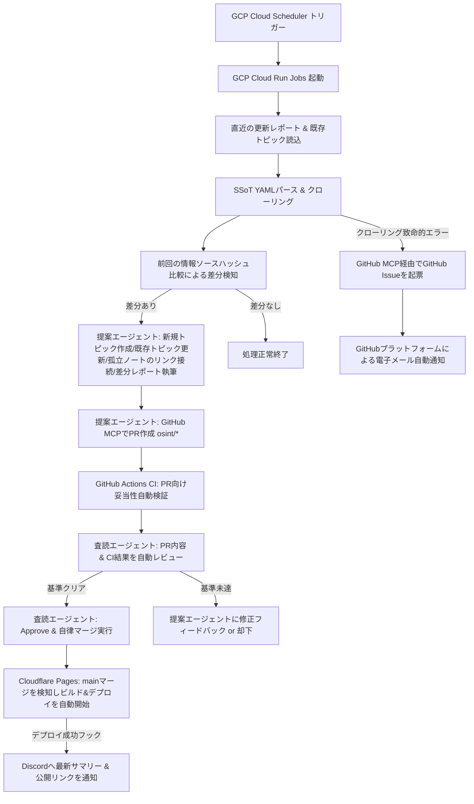

# 🛡️ kaname

> [!IMPORTANT]
> **自律型サイバーセキュリティナレッジオーケストレーター**

本ディレクトリは、日本のサイバーセキュリティ関連組織の動向を一元管理されたSSoT（Single Source of Truth）から自律的にクローリングし、LLMを活用して構造化された「LLM Wiki（Obsidian Vault）」を自動構築・デプロイ・通知する、自律型ナレッジオーケストレーションプラットフォーム `kaname` の完全な仕様書パッケージです。

> [!TIP]
> Inspired by [karpathy/llm-wiki.md](https://gist.github.com/karpathy/442a6bf555914893e9891c11519de94f)

仕様駆動開発（SDD: Spec-Driven Development）に基づき、グローバルな原則と feature 単位の実装仕様を分離して管理します。`constitution.md` は絶対不変の憲法ではなく、MUST / SHOULD / MAY の制約レイヤーとして扱い、技術選定や運用判断は `decisions/` の ADR で継続的に更新します。


## 🧭 コアワークフロー

システムは、GCP Cloud Scheduler のトリガーによって完全にステートレスに起動し、以下の自律マルチエージェント協調チェーンを実行します。




## 📁 ディレクトリ構造と仕様書案内

本パッケージは、関心の分離（SoC）の原則に従い、上流の行動規律から物理的なインターフェース契約にいたるまで、ドキュメントの責任範囲が以下のようにドリルダウン化されています。

```text
├── constitution.md          # MUST / SHOULD / MAY で表現する横断原則
├── spec.md                  # プロダクト全体の機能仕様書（legacy/global view）
├── ui-spec.md               # UI仕様書（Quartz表示制約、Graph View無効化）
├── business-rules.md        # 業務ルール（スケジューリング、分類、更新、通知契機）
├── plan.md                  # 技術設計計画書（アーキテクチャ、フェーズゲート）
├── data-model.md            # データモデル（SSoT、Cloud Storage state、OFM frontmatter）
├── checklist.md             # 品質検証チェックリスト
├── tasks.md                 # 横断タスクリスト（feature tasks への索引として維持）
├── traceability.md          # 仕様・コード・テスト・未実装ギャップの対応表
├── features/                # 実装単位の feature-oriented specs
│   ├── 001-crawler-idempotency/
│   ├── 002-wiki-incremental-update/
│   ├── 003-orchestrator-mcp-review-loop/
│   └── 004-cloudflare-discord-notification/
├── decisions/               # ADR（設計判断と constitution 例外/改訂履歴）
├── policies/                # セキュリティ・自律性・コンテンツ整合性ポリシー
├── schemas/                 # CI が直接読む実行可能 schema の配置先
├── contracts/
│   ├── mcp-contracts.md
│   └── webhook-contracts.md
├── research.md
└── implementation-details/
    ├── agent-logic.md
    └── directory-structure-analysis.md
```

### 各ドキュメントの詳細

- **[Feature-oriented specs (features/)](./features/README.md)**: 実装・PR単位で参照する feature spec、plan、tasks、acceptance を管理します。
- **[Traceability matrix (traceability.md)](./traceability.md)**: 要件、feature、コード、テスト、未実装ギャップを追跡します。
- **[開発綱領 (constitution.md)](https://www.google.com/search?q=./constitution.md)**: 単一言語（TypeScript）の徹底、待機コストを完全ゼロにするサーバーレスバッチ設計、AIモデルの抽象化、およびObsidian Flavored Markdown (OFM) 規格への準拠規律を定めています。
- **[機能仕様書 (spec.md)](https://www.google.com/search?q=./spec.md)**: サイバーセキュリティアナリストおよび運用者のユーザーストーリー、例外を含む全体論理ワークフロー、および要約の最小化や既存拡充を検証するためのBDDシナリオを定義しています。
- **[業務ルール定義書 (business-rules.md)](https://www.google.com/search?q=./business-rules.md)**: フォルダ乱立を100未満に抑える自律分類ロジック、上書きを禁止するインクリメンタル追記ルール、孤立ノートの解決ロジック、およびDiscord通知の厳格なトリガー制御を規定しています。
- **[UI仕様書 (ui-spec.md)](https://www.google.com/search?q=./ui-spec.md)**: Quartz v5 による静的公開を前提としたナビゲーション、目次（TOC）、被リンク（Backlinks）表示方針、およびビルド負荷とレンダリング負荷を排除するための「Graph View完全無効化」ルールを定義しています。
- **[技術設計計画書 (plan.md)](https://www.google.com/search?q=./plan.md)**: GCP・GitHub MCP・Cloudflare・Discordが交差する全体システムアーキテクチャ図と、採用技術スタックの選定理由、および開発の不確実性を排除する3つの「フェーズ・ゲート」を明示しています。
- **[データモデル仕様書 (data-model.md)](https://www.google.com/search?q=./data-model.md)**: 情報源を定義する `ssot.yml` の厳格なYAMLスキーマ、べき等性変更検知用の `crawler-state.json` のJSONスキーマ、および OFM メタプロパティ仕様を網羅しています。
- **[MCP・通知契約 (contracts/)](https://www.google.com/search?q=./contracts/)**:
  - `mcp-contracts.md`: インプロセスで通信するGitHub MCPサーバー（`@modelcontextprotocol/server-github`）とのJSON-RPC 2.0メッセージ構造（ファイル更新、PR起票、マージ、Issue作成）。
  - `webhook-contracts.md`: Cloudflare Pagesのデプロイ完了成功ペイロードと、Discord Webhookへ送信する構造化Rich Embedの物理JSON仕様。
- **[技術リサーチ報告書 (research.md)](https://www.google.com/search?q=./research.md)**: pnpm（幽霊依存の完全遮断）、esbuild / tsx（爆速ビルド・実行）の評価、Flatt Security社提供の「Takumi Guard」によるサプライチェーン保護、およびGitHub Appを用いたセキュアな動的認証方式の設計報告です。
- **[アルゴリズム・プロンプト詳細 (implementation-details/)](./implementation-details/)**:
    - `agent-logic.md`: オーケストレーターの対話ループを制御するメインスクリプトのTypeScript擬似コード、孤立ノート自動リンク解決ロジック、および既存Wikiデータを破壊させないための「Aegis-Writer」システムプロンプトの命令構造を配置しています。
    - `directory-structure-analysis.md`: 本仕様書パッケージにおける関心の分離（SoC）の妥当性評価、および実際のコードベース構築時におけるディレクトリ構造の推奨配置に関する議論をまとめています。
- **[品質検証チェックリスト (checklist.md)](https://www.google.com/search?q=./checklist.md)**: 設計したすべての規律、セキュリティ、ナレッジ整合性、暴走防止機能が正しく実装・動作しているかを1対1で機械的にテスト検証するための監査用受け入れリストです。
- **[実装タスクリスト (tasks.md)](https://www.google.com/search?q=./tasks.md)**: 開発ロードマップに基づき、テスト駆動開発（TDD）に準拠して自律オーケストレーションシステムを安全に開発するための、最もアトミックな実装ToDoリストです。


## 🛠️ 技術スタックと選定理由

開発綱領に基づき、外部依存の脆弱性やゼロデイリスクを極限まで遮断し、かつコスト効率と俊敏性を最大化する以下の技術スタックを採用します。

- **パッケージ管理 (`pnpm`)**: 爆速な速度に加え、フラットな `node_modules` を作らない構造により不当な「幽霊依存（Phantom Dependencies）」を機械的に100%排除し、サプライチェーンの安全性を保証。
- **ビルド・実行環境 (`esbuild` / `tsx`)**: TypeScriptの本番コンパイル（単一極小JSファイル出力）と高速なトランスパイル実行をミリ秒単位で実現し、Cloud Run Jobsのコールドスタートおよびエージェントのアイドリング時間を完全ゼロ化。
- **実行基盤 (`GCP Cloud Run Jobs` × `Cloud Scheduler`)**: 常時起動型仮想マシンを徹底排除し、待機時の課金コストを完全にゼロ（無風時ゼロコスト）とするイベント駆動型サーバーレスバッチ構成。
- **セキュリティ監査 (`Takumi Guard`)**: CIパイプラインにFlatt Security社の脆弱性検知エンジンを緊密に統合。依存ライブラリの脆弱性やライセンス違反が検知されたPRのビルド・マージを自動的に遮断。
- **コアロジックの自作 (`Native Fetch API` & `ビルトイン Regex`)**: `Axios` や `Cheerio` などの重量なサードパーティ製ライブラリを意図的に排除。標準APIと正規表現置換のみで安全かつ高速にタグ除去・テキスト抽出を行い、外部モジュールの脆弱性リスクを根本から遮断。
- **GitHub自律操作 (`GitHub MCP Server`)**: 単一コンテナ内において標準入出力（stdio）を介した安全なJSON-RPCインプロセス通信を採用し、外部へのAPIエンドポイントを一切非公開のままコミット、PR、Issue起票ツールをエージェントに委譲。


## 🛡️ 主要な自律ビジネスルール

システムが人間の手を離れて安全かつ高密度なナレッジグラフを自律構築するため、以下のガードレールが敷かれています。

1. **インクリメンタルアップデート（上書き禁止）**
既存トピックファイルがすでに存在する場合、単純な上書き（過去ファクトの損失）を絶対禁止します。既存のテキスト構造を温存したまま、最新の変更事実のみを論理的な新セクション（H3見出し等）へ自律的にマージ・統合します。
2. **孤立トピック自動接続（Orphan Note Linker）**
ナレッジの孤立（被リンク数がゼロの状態）を自動検知します。検出時、提案エージェントが既存トピックとの意味的な関連性を推論し、適切な側のドキュメント内に `[[トピック名]]` による内部リンクを動的に追記して情報の孤立状態を自動解消します。
3. **フォルダ乱立の最大制限ルール（最大100フォルダ未満保護）**
中間ディレクトリの総数が「95」に達した場合、新規フォルダの自律作成を強制的に遮断します。以降の新カテゴリは、代替共通フォルダ（`topics/misc/` 等）へ自動的に退避・集約させ、ナレッジベース全体のフラットさと秩序を両立します。
4. **内部リンクによる重複記述の徹底排除**
同一・類似情報の重複記述を避けるため、既存Wikiトピック等に記述済みのコンテンツに関しては、要約レポートへの再出力を禁止します。適えたい文脈は能動的に `[[内部リンク]]` を生成して参照させ、最新の差分事実のみにフォーカスしたサマリーを最小限の紙幅で構築します。
5. **無限ループ防止とフォールバックの自動Issue化**
提案（Aegis-Writer）と査読（Aegis-Reviewer）間の修正フィードバックループは「最大3回」でハードリミット制限されています。ループ上限の超過、または重大なクローリング通信障害の発生時は即座に処理を停止し、GitHub MCPを通じて管理者向けの「GitHub Issue」を自律起票し、GitHub標準の通知機能（メール等）に完全依存して安全にエスカレーションします。
6. **Discord誤送信の100%防止**
PR作成時や main マージ時での通知トリガーを厳格に禁止します。DiscordへのWebhook送信は、必ず本本番環境（Cloudflare Pages）への静的ファイルの展開完了を知らせるデプロイ成功イベントのフックに限定し、アクセスできないリンクの誤通知を100%ブロックします。


## 🚀 開発ロードマップとゲート (Phase Gates)

不確実性を排除しインクリメンタルに開発を進めるため、以下の3つの検証ゲートを設定しています。各ゲートのテストを100%クリアするまで次のフェーズへは移行しません。

### **Phase 1: サーバーレスバッチ ＆ クローリング基礎（基礎の確立）**
- *ゴール*: pnpm & esbuild 環境のセットアップ、SSoT YAMLパース、ビルトインFetchと正規表現によるテキスト抽出、およびハッシュ値ベースでのべき等性（差分検知）の確立。
- *検証ゲート*: 未更新ソースに対して不要なLLM接続やコミットが発生しないこと、および CI ライン上で Takumi Guard が正しく脆弱性を検知・遮断できること。

### **Phase 2: マルチエージェント協調 ＆ GitHub MCP自律操作（知能の確立）**
- *ゴール*: Aegis-Writerによるインクリメンタル更新、100フォルダ未満の中間ディレクトリ分類、Orphan Note Linker、およびAegis-ReviewerによるPR自動査読と自律マージの完結。
- *検証ゲート*: GitHub Appの一時トークンを用いたインプロセスstdio通信下で、エージェント間の3回上限の修正フィードバックループと、異常時のIssue自動起票が正しくフォールバック機能すること。

### **Phase 3: Quartzホスティング ＆ Discord連携（公開の確立）**
- *ゴール*: mainマージを検知した Cloudflare Pages での Quartz v5 自動静的ビルド（Graph View完全無効化）の確立、およびデプロイ成功イベントと連動したアクセスリンク付き Discord 要約通知の統合。
- *検証ゲート*: 破損リンクが混入したコミットに対して、GitHub ActionsのCIがマージを遮断し、本番公開およびDiscordへの誤通知が100%ブロックされることを実証。
