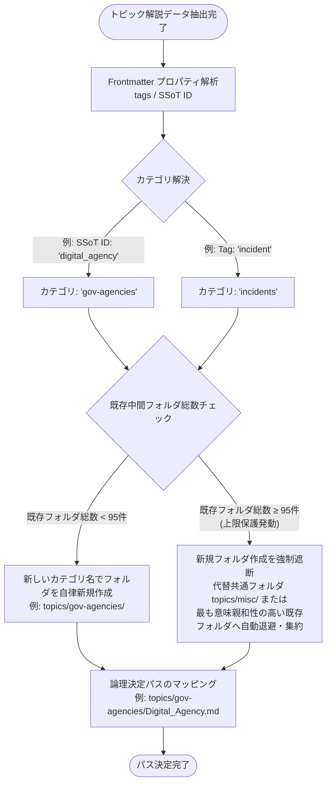

# `kaname` データモデル仕様書 (data-model.md)

## 1. SSoT (Single Source of Truth) YAML スキーマ

一元管理される情報源のメタデータリスト（ssot.yml）の厳格なスキーマを定義する。

```yaml
# ssot.yml の構造スキーマ
type: object
required:
  - ssot_sources
properties:
  ssot_sources:
    type: array
    items:
      type: object
      required:
        - id
        - name
        - url
        - description
      properties:
        id:
          type: string
          pattern: "^[a-z0-9_]+$"
          description: "システム内部で用いる一意の識別コード"
        name:
          type: string
          description: "組織・ソースの正式名称"
        url:
          type: string
          format: uri
          description: "クローリング対象の公式サイトメインURL"
        feed_url:
          type: string
          format: uri
          description: "RSS/Atom配信がある場合のXMLエンドポイントURL（任意）"
        description:
          type: string
          description: "組織の役割・解説文"
        meta_url:
          type: string
          format: uri
          description: "組織の概要が記載された副次的なURL（任意）"
        custom_extraction_instruction:
          type: string
          description: "このソースから情報抽出する際にLLMに与える固有のプロンプト（任意）"
```


## 2. 状態管理（べき等性検証用メタデータ）スキーマ

不要なLLMの呼び出し、コミット、PRの作成を機械的に防止するため、前回の処理結果を記録する軽量な変更検知ステート（crawler-state.json）のデータ構造。`crawler-state.json` は Git repository に commit せず、Cloud Storage の object として保存する。

Cloud Storage 推奨配置:

```text
gs://<KANAME_STATE_BUCKET>/<environment>/crawler-state.json
```

state 書き込みは generation precondition を用い、並行 Cloud Run Jobs による last-write-wins を防止する。

```json
{
  "$schema": "http://json-schema.org/draft-07/schema#",
  "title": "CrawlerState",
  "type": "object",
  "required": ["last_execution", "sources"],
  "properties": {
    "last_execution": {
      "type": "string",
      "format": "date-time",
      "description": "最後にクローラーが正常完了したUTC ISO-8601時刻"
    },
    "sources": {
      "type": "object",
      "additionalProperties": {
        "type": "object",
        "required": ["last_checked", "content_hash", "last_modified_header"],
        "properties": {
          "last_checked": {
            "type": "string",
            "format": "date-time"
          },
          "content_hash": {
            "type": "string",
            "description": "ビルトインFetchで取得した本文テキストのSHA-256ハッシュ値"
          },
          "last_modified_header": {
            "type": ["string", "null"],
            "description": "HTTPレスポンスのLast-Modifiedヘッダー値（条件付きGET要求用）"
          }
        }
      }
    }
  }
}
```


## 3. 階層分類トピックディレクトリ・パス決定モデル

トピックファイルの中間ディレクトリ決定、およびシステム制限である最大100フォルダ未満の保護を保証するための論理パス決定ワークフロー。




## 4. Obsidian Flavored Markdown (OFM) メタプロパティ仕様

提案エージェント（Aegis-Writer）が出力・更新するすべてのトピック解説Markdownファイルは、ObsidianおよびQuartz v5に解釈可能な以下のYAML Frontmatterプロパティを保持しなければならない。

```markdown
---
title: "トピック正式名称"
aliases: ["名寄せ用別名1", "別名2"]
last_updated: yyyy-mm-ddThh:mm:ssZ
tags:
  - "cyber-intelligence"
  - "security-organization"
category: "gov-agencies" # 中間ディレクトリ分類名と厳密に1対1対応
status: "active"
sources:
  - "https://www.cyber.go.jp/"
---
# トピック正式名称

（ここから本文がOFM準拠で開始される）
```


## 5. 仕様最終フィックスにともなう拡張物理型定義（TypeScript型契約）

本セクションに定義する TypeScript 型定義は、システムが自律マージ・コスト暴走・名寄せ競合を決定論的に制御するための、コード実装における絶対的な物理契約（Constraint）である。

### 5.1 状態管理競合制御コンテキスト (Cloud Storage Precondition)
GCP Cloud Storage への状態ファイル（`crawler-state.json`）保存時において、並行ジョブによる Last-Write-Wins 破壊を 100% 防御するための世代制御トークンを内包する構造。

```typescript
export interface SourceState {
	last_checked: string;
	content_hash: string;
	last_modified_header: string | null;
}

export interface CrawlerState {
	last_execution: string;
	sources: Record<string, SourceState>;
}

/**
 * 状態管理の競合制御 (GCP Storage Precondition) を内包する実行状態コンテキスト
 */
export interface CloudStorageStateContext {
	state: CrawlerState;
	/** GCP Cloud Storage のオブジェクト固有の世代識別トークン (if-generation-match用) */
	generationToken: string | null;
}
```

### 5.2 インプロセス同期的オーケストレーション状態定義
AIエージェントの修正フィードバック往復（最大3回）を、Cloud Run Jobs のインフラタイムアウト（30〜60分）内で同期的・決定論的に安全に完結させるためのステートマシン定義。

```typescript
export type OrchestratorStatus = 
	| "IDLE"
	| "CRAWLING"
	| "PROPOSING"              // Aegis-Writer が修正・提案を作成中
	| "REVIEWING"              // Aegis-Reviewer が差分および検証結果を査読中
	| "AUTONOMOUS_MERGING"     // 基準クリアによる main への自律マージ実行中
	| "LOOP_FALLBACK_ABORT"    // 3回ループ超過による緊急停止・遮断
	| "SYSTEM_ERROR_ESCALATION" // 例外発生時における Issue 自動起票中
	| "SUCCESS_COMPLETED";

export interface OrchestratorRuntimeContext {
	status: OrchestratorStatus;
	/** 暴走防止: 1セッション内の修正往復回数を正確にカウント (ハードリミット: 3) */
	feedbackLoopCount: number;
	/** コスト暴走防止: インフラ制限時間を超過しないよう監視するためのセッション開始UTCミリ秒 */
	sessionStartedAt: number;
	currentBranchName: string | null;
	currentPullRequestNumber: number | null;
}
```

### 5.3 Vault内名寄せ逆引きインデックスモデル
Aegis-Writer がキーワード抽出を行った際、ファイル名としては存在しないが、既存トピックの `aliases`（名寄せ別名）に登録されている場合に、重複ファイルを新規作成してしまう暴走を決定論的にルーティング・阻止するためのマップ構造。

```typescript
/**
 * Vault内の重複作成を100%阻止するための名寄せインデックス構造
 */
export interface TopicAliasMap {
	/** 抽出キーワード(名寄せ別名含む) ➔ 物理的なトピック解説ファイルパスへの一意のマッピング */
	[keywordAlias: string]: {
		resolvedFilePath: string; // 例: "topics/gov-agencies/Digital_Agency.md"
		primaryTitle: string;     // 例: "Digital Agency"
	};
}
```

### 5.4 決定論的品質検証結果（ローカル検証ゲート契約）
待機コストおよび非同期 CI のポーリング複雑性を完全排除するため、オーケストレーターコンテナ内部で決定論的に実行されるリンター、リンクチェック、および Takumi Guard 依存性監査関数の期待値契約。Aegis-Reviewer はこの構造化データを受け取って冷徹に審査する。

```typescript
/**
 * 結合検証用: 査読エージェント（Aegis-Reviewer）への入力データ構造
 * (コンテナ内で決定論的にローカル実行された全検証結果のサマリー)
 */
export interface DeterministicCIResult {
	typecheckPassed: boolean;
	lintPassed: boolean;
	noDeadLinks: boolean;
	ofmCompliant: boolean;
	noOverwritePolicyRespected: boolean; // 既存の歴史的セクションが削除されていないか
	/** 憲章のMUST要件: Takumi Guardの監査成否。通信不通や不定ステータス時は強制的にfalse */
	takumiGuardPassed: boolean;
}
```
