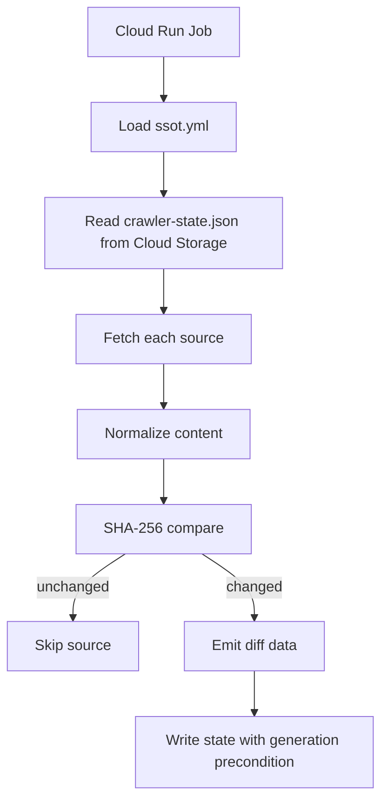

# Plan: Feature 001

## Architecture

## State backend

Use Cloud Storage as the default state backend. Firestore MAY be used later if queryability or transactional multi-object updates become necessary.

## Parser policy

Start with Native Fetch and minimal string processing. If malformed HTML / RSS coverage becomes brittle, introduce an approved parser through ADR.
