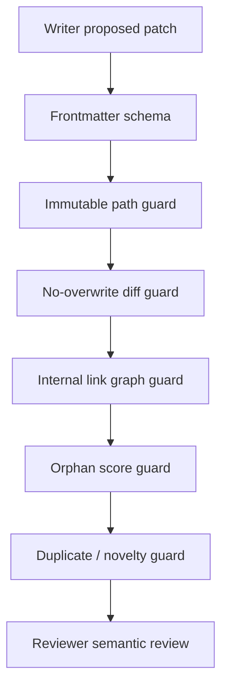

# Plan: Feature 002

## Deterministic guard pipeline

## Implementation notes

- Markdown manipulation utilities are allowed, but full Writer output must be validated as a whole document.
- Semantic link suggestions are LLM-assisted; graph validation is deterministic.
