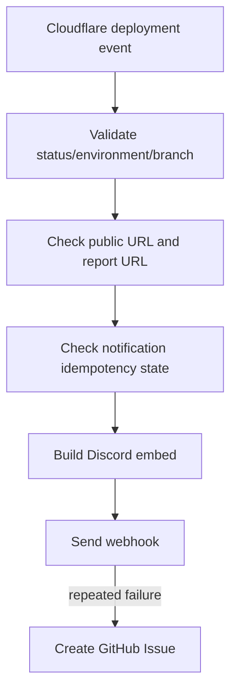

# Plan: Feature 004

## Flow

```mermaid
flowchart TD
  A[Cloudflare deployment event] --> B[Validate status/environment/branch]
  B --> C[Check public URL and report URL]
  C --> D[Check notification idempotency state]
  D --> E[Build Discord embed]
  E --> F[Send webhook]
  F -- repeated failure --> G[Create GitHub Issue]
```
