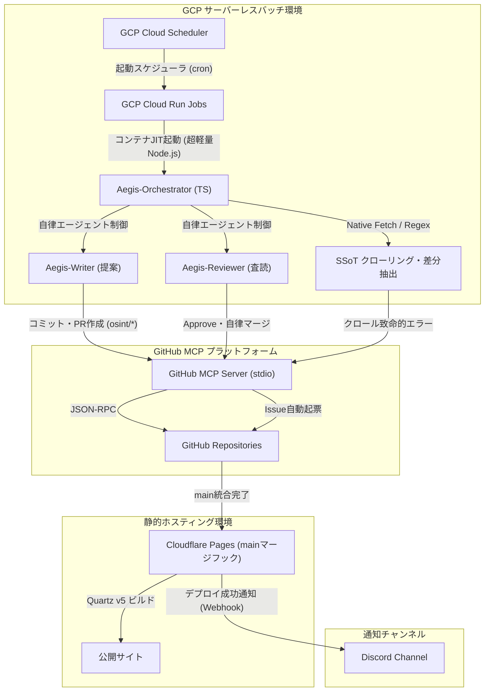

# `kaname` 技術設計計画書 (plan.md)

## 1. 全体システムアーキテクチャ
本システムは、完全サーバーレスでイベント駆動型のバッチ実行環境と、マルチエージェント型LLM（Aegis-Writer / Aegis-Reviewer）による自律プルリクエスト（PR）生成・マージ機構を統合したアーキテクチャを採用する。

## 2. 技術スタック選定基準と理由

開発綱領に準拠し、本システムで採用する技術スタックとその選定理由は以下の通りである。

| レイヤー | 採用技術 | 選定理由 |
| :--- | :--- | :--- |
| **パッケージ管理** | pnpm | インストール速度、ディスク効率、および「幽霊依存（Phantom Dependencies）」を機械的に100%排除してサプライチェーン安全性を保つため。 |
| **ビルド・実行環境** | esbuild / tsx | TypeScriptの爆速トランスパイル・実行を実現するGo製ランタイム。Cloud Run Jobsのコールドスタートをミリ秒単位に極小化する。 |
| **起動・スケジュール** | GCP Cloud Scheduler | クラウド上の完全マネージドな時間駆動トリガー。待機コストが完全ゼロであり、実行周期の変更が容易。 |
| **バッチ実行基盤** | GCP Cloud Run Jobs | 常時起動インスタンスを持たないイベント駆動コンテナ。ミリ秒単位の実行課金のみで動きタイムアウト（最大24時間）にも余裕があるが、エージェントのバグや通信ハングによるコスト高騰を防ぐため、ジョブ設定上の最大実行時間を30~60分（想定最大処理時間の安全マージン込み）に制限する。 |
| **セキュリティ・依存スキャン** | Takumi Guard + baseline CI gates | Takumi Guard は保護対象 PR の必須 gate とし、通信不通・サーバ側障害・indeterminate status では fail-closed とする。typecheck、test、secret scanning、deterministic content guards と合成して自律マージ可否を判断する。 |
| **HTTPクライアント** | Native Fetch API | Node.js標準のビルトインAPI。サードパーティ製クライアント（Axios等）を排除し、外部モジュールのゼロデイ脆弱性リスクを遮断する。 |
| **HTML/XMLパース** | Native String / Regex を初期値、必要時に ADR 承認 parser | 依存最小化は SHOULD とするが Regex only は MUST ではない。実サイトの揺れで正確性・保守性が落ちる場合は ADR と security gate を通して parser 依存を導入できる。 |
| **LLM抽象レイヤー** | 抽象インターフェース (Aegis-Client) | 特定モデルのSDKに直接依存せず、主要AIベンダーが提供するその時点で最新かつ最適なモデルへ動的にスイッチ可能なラッパー層を自作する。 |
| **GitHub自律操作** | GitHub MCP Server (Node.js) | GitHub公式のプロトコル。単一コンテナ内で標準入出力（stdio）を介した安全なJSON-RPCインプロセス通信を行い、コミット・PR・Issue起票を制御する。 |
| **静的ビルド・配信** | Quartz v5 × Cloudflare Pages | ビルド処理をCloudflare側へ完全移譲。Graph Viewを完全無効化（disabled）し、エッジネットワーク上でQuartzビルドとホスティングを自動連携。 |
| **通知連携** | Discord Webhook | デプロイ成功イベントを本番公開リンク付きでセキュアかつ簡潔に統合可能。 |

## 3. 開発フェーズ・ゲート（Phase Gates）

システム構築における不確実性を排除し、インクリメンタルに検証を進めるため、以下の3つの開発フェーズを定義する。各フェーズは前フェーズの検証（Gate）を完全にパスするまで移行しない。

### Phase 1: サーバーレスバッチ ＆ クローリング基礎 (基礎の確立)

- **マイルストーン:** Cloud Run Jobs上でpnpm & esbuildを用いてコンテナがビルドされ、SSoT（YAML）からデータ抽出し、Cloud Storage に保存された state とハッシュ値ベースで差分検知できること。
- **検証ゲート:** テスト環境において、未更新のソースに対してべき等性が働き、不要なLLM接続やコミットが発生しないこと。Cloud Storage generation precondition による state 競合制御が検証されていること。また、Takumi Guard を含む security gate が CI 上で fail-closed に動作すること。

### Phase 2: マルチエージェント協調 ＆ GitHub MCP自律操作 (知能の確立)

- **マイルストーン:** Aegis-Writerによるインクリメンタル更新（上書き禁止ポリシー）、最大100フォルダ未満を保証する中間ディレクトリ自動分類、孤立ノートのリンク再接続、およびAegis-ReviewerによるPR自動コードレビューとマージ合意形成が動作すること。
- **検証ゲート:** GitHub Appから短期トークンを取得し、インプロセスstdio通信のGitHub MCPサーバーを介して、エージェント間での修正フィードバックループ（最大3回までループ）と自律マージ・Issue自動起票が正しく機能することを検証する。

### Phase 3: Quartzホスティング ＆ Discord連携 (公開の確立)

- **マイルストーン:** main マージに追従した Cloudflare Pages での Quartz v5 自動静的ビルド（Graph View無効化状態）、およびデプロイ完了成功トリガーを起点とするDiscordへのアクセスリンク付き要約レポート通知を確立すること。
- **検証ゲート:** 破損リンクが混入したコミットを流した際、GitHub ActionsのCIでビルドが遮断され、本番URLへのデプロイおよびDiscordへの誤リンク通知が確実にブロックされることを実証する。

## 4. 各詳細設計ファイルへのインデックス（リンク構造）

各詳細コンポーネントの設計情報は、階層的詳細管理ルールに基づき、以下のサブ設計ドキュメント群に細分化して管理する。

- **データモデル仕様書**
  SSoT YAMLスキーマ、べき等性状態管理JSONスキーマ、最大100フォルダ閾値管理の中間ディレクトリ自動分類、およびYAML Frontmatterプロパティ定義。
- **インターフェース・契約仕様書（contracts）**
  Stdio JSON-RPC経由で呼び出す各種ツールの契約スキーマ、および中間ディレクトリ分類に基づいたパス構成。
- **外部通知・連携仕様書（contracts）**
  Cloudflare Pagesデプロイ完了Webhookペイロード、およびアクセスリンク付きDiscord Embeds WebhookのJSONフォーマット。
- **技術リサーチ報告書**
  pnpm/esbuildの技術選定、Takumi GuardによるCIセキュリティ統合、およびstdio MCPサーバー起動設計リサーチ。
- **アルゴリズム・設定詳細（implementation-details）**
  Aegis-Orchestrator対話ループ状態遷移擬似コード、孤立トピック自動接続アルゴリズム、およびインクリメンタルアップデートのプロンプト命令構造。

## 5. 書誌情報

- Karpathy, Andrej. "LLM Wiki." GitHub Gist, 2025, gist.github.com/karpathy/442a6bf555914893e9891c11519de94f.
- "Quartz." GitHub, 2026, github.com/jackyzha0/quartz.
- "Obsidian." Obsidian, 2026, obsidian.md.
- GitHub. "GitHub MCP Server." GitHub, 2026, github.com/github/github-mcp-server.
- kepano. "Obsidian Skills." GitHub, 2026, github.com/kepano/obsidian-skills/blob/main/skills/obsidian-markdown/SKILL.md.
- Flatt Security. "Takumi Guard." Flatt Security Inc., 2026, flatt.tech/takumi/features/guard.
