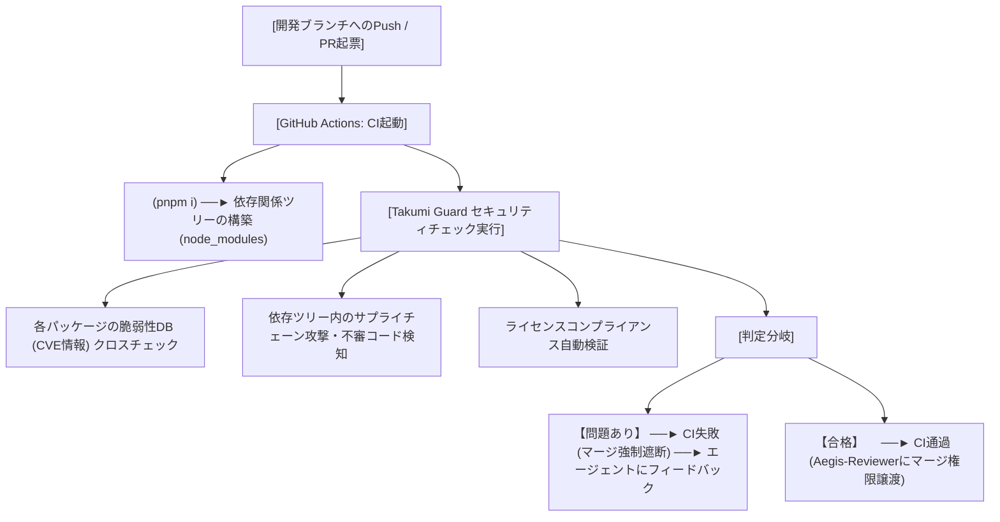
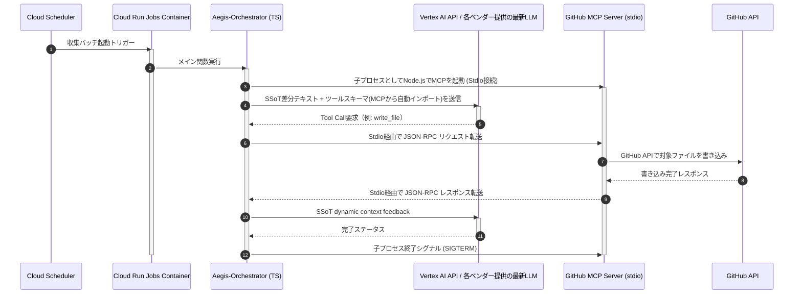

# `kaname` 技術リサーチ報告書 (research.md)

## 1. パッケージマネージャー ＆ 高速ビルドエンジンの選定

本プロジェクトの品質、ビルドの俊敏性、およびサプライチェーンセキュリティを最大化するため、Node.js/TypeScriptエコシステムにおける各種パッケージ・開発ツールの検証評価を以下に示す。

### 1.1 パッケージマネージャー（Package Manager）比較

| ツール名 | インストール速度 | ディスク容量効率 | 依存関係の厳格性 (Phantoms) | 採用可否 | 選定理由 |
| :--- | :--- | :--- | :--- | :--- | :--- |
| pnpm | 極めて高速 | 最優秀 (グローバルストア・ハードリンク) | 極めて厳格 (フラットなnode_modulesを作らず、幽霊依存を100%防止) | 採用 | 速度、ディスク効率、何より不当なサプライチェーン依存（幽霊依存）を機械的に完全に遮断する構造から、インテリジェンスバッチに最適。 |
| npm | 遅い | 悪い (多重コピー) | 緩い (扁平化による依存関係の汚染) | 不採用 | 依存関係が扁平化し、ライブラリの脆弱性伝播リスクが相対的に高い。 |
| yarn (v1) | 普通 | 悪い | 緩い | 不採用 | モダンプロジェクトで推奨されず、pnpmを上回るメリットがない。 |

### 1.2 TypeScriptビルド ＆ 実行ランタイム比較

| ツール名 | ビルド速度 | 開発時ロード・起動 | プロダクション最適化 (バンドル) | 採用可否 | 選定理由 |
| :--- | :--- | :--- | :--- | :--- | :--- |
| tsx | 超高速 | 瞬時起動 (esbuildによるJIT型トランスパイル) | (実行専用のためバンドルは不可) | 採用 | ローカル開発、およびGCPバインディングでのスクリプト直接実行に最適。コンパイル待ちによるエージェントのアイドリング時間を完全ゼロ化。 |
| esbuild | 最速 (ミリ秒単位) | 瞬時 | 極めて優秀 (不要コード除去・極小JSシングルファイル出力) | 採用 | Go製コンパイラ。Cloud Run Jobsコンテナ起動速度を極限まで高めるため、TypeScriptの本番ビルドとトランスパイルに採用。 |
| tsc (Native) | 遅い | 著しく遅い | なし (個別トランスパイル) | 型検証のみ | 型定義のチェック（tsc --noEmit）でのみCIで利用し、ビルドコンパイル処理自体には直接関与させない。 |

## 2. セキュリティ統合・脆弱性保護のベストプラクティス（Takumi Guard）

開発効率を著しく損ねる「外部依存性ゼロ」の極端な制限に固執するのではなく、サードパーティライブラリを最小限に許容した上で、Flatt Security社が提供する `Takumi Guard` をCI/CDプロセスへインテグレーションすることで高いセキュリティ強度（真正性保証）を確立する。

### 2.1 CI/CD パイプライン ＆ セキュリティチェックフロー

## 3. ヘッドレス環境におけるLLMオーケストレーションとMCPホスティング

GCP Cloud Run Jobsなどの非対話的なサーバーレスバッチにおいて、複数のLLMエージェントを安全かつ効率的にホスティング・制御する設計は以下の通り。

### 3.1 MCPサーバーのホスティング設計
GitHub公式のMCPサーバー（`@modelcontextprotocol/server-github`）は、標準入出力（stdio）を介してJSON-RPCで動作するNode.jsパッケージである。
本システムでは、コスト極小化およびセキュリティ（外部へのAPIエンドポイント非公開）の観点から、「単一コンテナ内における stdio（標準入出力）を介したインプロセス通信」を採用する。

## 4. マルチエージェント（提案・査読）の相互対話メカニズム

対話シェルが存在しない環境において、提案（Aegis-Writer）と査読（Aegis-Reviewer）のマルチエージェント協調を実現するため、オーケストレーターが実行状態（ステートマシン）を完全に制御する。

### 4.1 協調実行フェーズ（2-Agent Cooperative Phase）

#### 提案フェーズ（Aegis-Writerのターン）

- **インプット:** SSoT最新差分、直近レポート、既存Wikiトピック。
- **動作:** LLMに「Aegis-Writer」の役割を与えるシステムプロンプトを注入。LLMはデータに基づき、既存ドキュメントのインクリメンタル更新や孤立リンクの補正ロジックに沿って、GitHub MCPを介してファイルの書き込み（コミット）およびインテリジェンスブランチ（`osint/*`）へのPR起票ツールを実行する。
- **アウトプット:** 起票されたプルリクエスト（PR）の番号。

#### 査読フェーズ（Aegis-Reviewer of ターン）

- **インプット:** 起票されたPRのDiff（変更差分）、GitHub Actionsの自動テスト成否、開発綱領（`constitution.md`）の整合ルールチェックリスト。
- **動作:** オーケストレーターはLLMに「Aegis-Reviewer」の役割プロンプトを与えて起動。LLMはPR Diffおよびテスト結果を評価。
- **分岐:**
  - **レビュー合格:** 査読エージェントがGitHub MCPを介して「Approve」を付与し、さらに「自律マージ」ツール（`merge_pull_request`）を実行してPRを完了させる。
  - **レビュー不合格:** 査読エージェントが修正すべき点を指摘するコメントをPR上に自律起票。オーケストレーターは状態を提案フェーズにロールバックし、Writerに再修正を促す（最大3回までループ）。

## 5. セキュアな認証方式（GCP - GitHub間）

ヘッドレス環境からGitHubへの書き込み・マージ権限を安全に委譲するための認証メカニズムとして、本システムでは静的な「個人アクセストークン（PAT）」の共有を一切禁止する。

### 5.1 GitHub Appトークンによる一時認証

- リポジトリごとに専用の「GitHub App」を登録。
- GCP Secret Manager に安全に保存された GitHub App の秘密鍵（Private Key）および App ID を実行時にロード。
- 実行時に GitHub 認証APIを叩き、数分から最大1時間のみ有効な「インストーショントークン（Installation Access Token）」を動的に生成し、これをMCPサーバーの環境変数 `GITHUB_PERSONAL_ACCESS_TOKEN` に注入して処理を実行する。
- これにより、静的トークンの漏洩リスクを根本から排除する。

## 6. 書誌情報

- Model Context Protocol. "Specification." Anthropic, 2026, modelcontextprotocol.io.
- GitHub. "GitHub MCP Server." GitHub, 2026, github.com/github/github-mcp-server.
- Google Cloud. "Cloud Run Jobs Overview." Google Cloud, 2026, cloud.google.com/run/docs/create-jobs.
- Flatt Security. "Takumi Guard." Flatt Security Inc., 2026, flatt.tech/takumi/features/guard.
