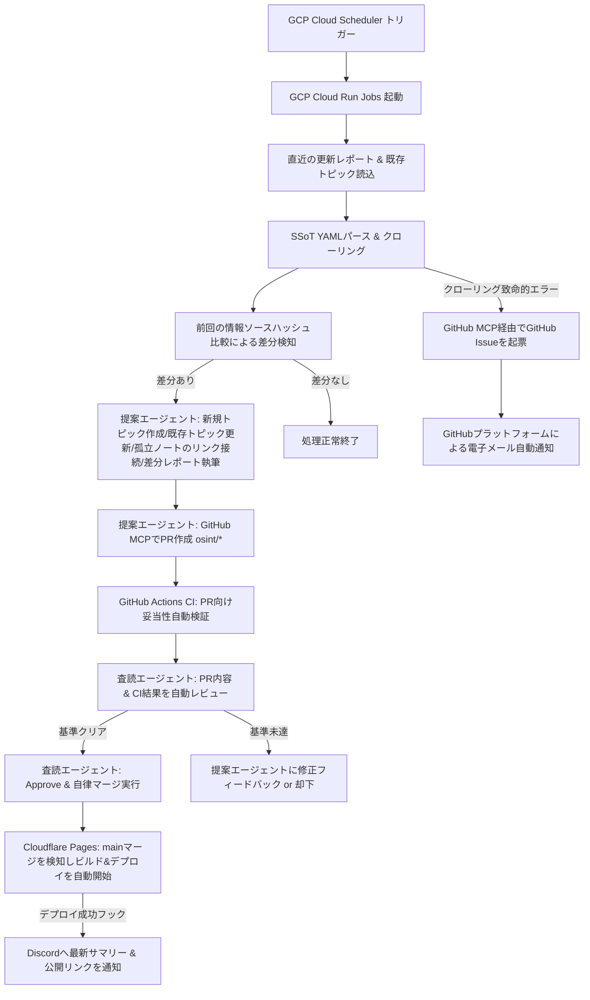

# `kaname` 機能仕様書 (spec.md)

## 1. 概要と目的
本システムは、日本のサイバーセキュリティ関連組織の動向を一元管理されたSSoT（Single Source of Truth）から自律的にクローリングし、LLMを活用して構造化された「LLM Wiki（Obsidian Vault）」を自動構築・デプロイ・通知する、自律型ナレッジオーケストレーションプラットフォームである。

## 2. ユーザーストーリー

### サイバーセキュリティアナリストとしてのストーリー

スケジューラ（GCP Cloud Scheduler）側のトリガー調整により柔軟にコントロールされる自動更新周期に基づき更新されるWikiを通じて、国内主要組織のアラートや地政学的情勢報告の最新情報を、重複を排除し内部リンクによる高密度なナレッジグラフへと再構成された「要約更新レポート」および継続的に情報が追加・統合されるWikiトピックページを通じてタイムリーに把握したい。

### プラットフォーム運用者としてのストーリー

サーバーの管理コストや無駄なクラウド課金を最小限に抑えつつ、情報更新がある場合、提案エージェントと査読エージェントが協調して自動で「PR作成・コードレビュー・Approve・自律マージ」までを一気通貫で実施し、マージ後の Cloudflare Pages による本番自動ビルド・デプロイが完了したタイミングで安全にDiscordに公開通知が飛ぶインテリジェントな自動化フローを運用したい。

## 3. コアワークフロー

システム全体の論理フローは以下の通りである。

## 4. 機能要件

### 4.1 SSoT (Single Source of Truth) 管理機能と実行制御

- YAMLフォーマットで定義された情報源（URL、配信Feed、対象メタデータ、および個別抽出プロンプト方針）を正確に読み込む。
- **実行スケジュールの分離設計：** システム自体のコードベースはスケジュール管理機構を持たず完全にステートレスで動作する。起動頻度の変更は GCP Cloud Scheduler の設定（cron式）変更のみで完結し、運用要件、APIコスト、インテリジェンスの緊迫度に応じて、週次から時次までダウンタイムなしで柔軟にスケジューリングのスケール変更を可能とする。

### 4.2 LLMによる構造化・OFM変換・既存ファイル更新機能

- 抽出キーワードを固定せず、対象SSoTソースごとの特性に応じて、ソースごとに最適な「重要な情報、関連トピック、重要動向」を提案エージェントが自律的かつ適応的に抽出する。
- **既存トピックの継続的アップデート（更新責任）：** 抽出したトピックがすでに Obsidian Vault 内に存在する場合、ファイルを単純に上書きするのではなく、既存のコンテンツを活かしつつ最新の検知ファクトを自律的にマージ・統合（インクレメンタル・アップデート）してファイルを書き換える。
- **孤立トピックの自動リンク構築（Orphan Note Linker）：** 提案エージェントは、新規トピック作成または既存トピックの更新の過程で、Vault内に他のどのドキュメントとも接続していない「孤立したトピックファイル」が存在するかを検出する。検出時、エージェントは自律的に他の既存Markdownトピックとの意味的な関連性（シナジー）を見出し、適切な側のMarkdownドキュメントを自動更新して `[[トピック名]]` による内部リンクを双方向または片方向に接続して情報の孤立状態を自動解消する。

### 4.3 定時レポート作成・Discord通知機能

- スケジュール起動時に、まず「直近のレポートファイル（Markdown）」をシステムが自動的にインプットとしてパースする。
- パース結果と最新のSSoTデータ収集結果を突き合わせ、まだレポートに記載されていない新規性の高い変更内容（新規トピックの作成、特定ドキュメントの大幅な更新、新たな関連性）のみを「更新差分」として厳密に抽出する。
- **内部リンクによる重複記述の徹底排除：** 同一・類似情報の重複記述を避けるため、既存のレポートやWikiトピックページに記述済みのコンテンツに関しては「説明テキスト」を紙幅を割いて再記述しない。適宜、該当する既存トピックや過去のレポート名に対する `[[内部リンク]]` を能動的に作成して参照させ、最新情報のみにフォーカスしたサマリーを最小限の記述で作成する。
- Discord通知は、GitHubへのコミット・プッシュ時ではなく、Cloudflare Pagesへの静的ビルド＆本番デプロイメントの完了通知（Deployment WebhookまたはActionsのデプロイ確認）をトリガーとして、実際に閲覧可能な最新の公開アクセスリンクを添えて送信する。

### 4.4 マルチエージェントによる自律型GitHub操作機能（MCP連携）と障害通知

- **マルチエージェント協調システム：** 提案エージェントがインテリジェンスブランチ（`osint/*`）を作成し、「ファイルの追加/修正コミット」「PR作成」を実行した後、査読エージェントがPRの妥当性を自律レビューし、合意のうえで `main` ブランチへの「自律マージ」までを実行する。
- クローリングの致命的失敗やLLM APIレートリミット障害等の例外時、GitHub MCPを介して管理者向けの「GitHub Issue」を自律的に自動起票する。
- 障害通知はGitHubプラットフォームが提供する標準機能（Issue作成時の電子メール送信、プッシュ通知、メンション通知）に完全依存し、システム側に独自の電子メール送信サーバーなどの外部送信機能を実装しない。

## 5. BDD（Behavior-Driven Development）シナリオ

### シナリオ1: 直近レポートおよび既存Wikiトピックへの内部リンク生成による最小要約

- **Given** システムがスケジュール起動し、直近のレポート「`2026-05-26_Report.md`」および既存トピックページ「`[[能動的サイバー防御]]`」を読み込んでいる
- **When** クローラーがSSoTから能動的サイバー防御に関する新たな個別通知を検知したが、その制度概要や基本方針自体はすでに既存の「`[[能動的サイバー防御]]`」トピックに記述されているとき
- **Then** 提案エージェントは重複する制度概要のテキスト記述を徹底的に排除し、新旧 of 差分ファクトのみをレポート（`2026-05-27_Report.md`）に記載し、詳細は既存トピック「`[[能動的サイバー防御]]`」や「`[[2026-05-26_Report]]`」への内部リンクを作成して参照させ、最小限かつ高密度なナレッジグラフを構築すること。

### シナリオ2: 既存トピックファイルの自律的更新と拡充

- **Given** Obsidian Vault内に、すでに「`[[JPCERT/CC]]`」に関するトピックファイルが存在している
- **When** 新たなクローリングで、JPCERT/CC of 新たな活動ファクト（例：新たな注意喚起スキーム）を検知したとき
- **Then** 既存ファイルを新規ファイルで上書き消去するのではなく、既存の記述（歴史、役割など）を温存したまま、今回検知された最新スキームの情報を適切な章（Heading）として追加または既存のセクションに自律統合し、更新後のファイルをコミットすること。

### シナリオ3: 孤立したトピックファイルの自動検出とリンク接続

- **Given** Obsidian Vault内に、どのページからもリンクされていない孤立したトピックファイル「`[[サイバー演習CYDER]]`」が存在している
- **When** 提案エージェントが「`[[情報通信研究機構 (NICT)]]`」に関するページを新規作成または更新するプロセスを実行したとき
- **Then** 提案エージェントは意味的な関連性を自律判断し、「`[[情報通信研究機構 (NICT)]]`」の活動セクション内に `[[サイバー演習CYDER]]` への内部リンクを動的に追記してコミットし、ナレッジの孤立状態を自律的に解消すること。

### シナリオ4: マルチエージェント協調による自律PRレビューとマージの完了

- **Given** 提案エージェントが自動作成した `osint/jpcert-update` ブランチのPRがGitHub上に起票されている
- **When** GitHub Actionsでの自動検証（Lintやリンクチェック）が成功し、査読エージェントがPRの内容変更が開発綱領・OFM規格を満たしていると自律判断したとき
- **Then** 査読エージェントはGitHub MCPを介してPRに承認（Approve）コメントを付与し、さらに `main` ブランチへマージ処理を実行してPRをクローズすること。

### シナリオ5: Cloudflare Pages 連携ビルド・デプロイ成功をフックしたDiscord通知

- **Given** 査読エージェントによる自動マージが完了し、GitHub上の `main` ブランチが更新された
- **When** Cloudflare Pages の自動ビルドがキックされ、Quartz v5によるエッジビルドが完了して本番サーバーへのデプロイ成功イベントが発生したとき
- **Then** システム（またはデプロイワークフロー）は、ビルド不全のない正しい本番公開サイトURLおよび更新レポートのサマリーをDiscordチャンネルへ通知すること（マージされただけの未デプロイ状態、またはビルド失敗状態でのフック送信は絶対に行わないこと）。

### シナリオ6: 障害時の自律的Issue起票とGitHub通知への依存

- **Given** SSoT内の特定サイトへの接続がエラー（HTTP 500等）になり、自動リトライが失敗した
- **When** 障害を検知したシステムがGitHub MCPサーバーを介してリポジトリ上に「`$$System Error$$ Crawling Failed for ID: nco`」というIssueを自律起票したとき
- **Then** 外部の電子メール送信サーバー等は一切稼働させず、GitHubプラットフォームの設定に登録されている管理者宛てにGitHub標準のIssue起票メール通知が自動配送されること。

## 6. 書誌情報

- Karpathy, Andrej. "LLM Wiki." GitHub Gist, 2025, gist.github.com/karpathy/442a6bf555914893e9891c11519de94f.
- "Quartz." GitHub, 2026, github.com/jackyzha0/quartz.
- kepano. "Obsidian Skills." GitHub, 2026, github.com/kepano/obsidian-skills/blob/main/skills/obsidian-markdown/SKILL.md.
