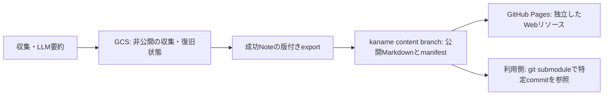

# kaname — 公開するLLM生成の技術Note

kanameは技術情報を収集・要約し、日々更新される生成Noteを独立したリソースとして提供するプロジェクトです。
**同じ公開Note群を、GitHub Pagesと、人力Vaultからのgit submodule参照で利用します。**
人力で構成するVaultは別リポジトリで管理し、その公開範囲・編集・コミュニティプラグイン設定は本プロジェクトの対象外です。

現在は収集・非公開GCS保存に加え、実GCSからの読取りexportとGit配布を検証しています。
117件の生成Noteは[公開Note一覧](https://github.com/Ningensei848/kaname/tree/content/notes)で参照できます。
同じ配布commitからのWeb buildも検証済みです。GitHub Pagesのdeploy workflowは実装済みで、初回実deployの受入と日次公開の自動化が次の確認事項です。
[Pages手順](docs/pages.md)に権限・公開・切戻しの操作を記載しています。
決定の背景と旧仕様との差は[ADR-0001](docs/adr/0001-generated-content-module-and-pages.md)に記録しています。



生成Noteの配布元を独立させることで、Webは新しい公開版へ更新し、人力Vaultは必要な版を参照できます。
Pagesの構築に人力Vaultを読み込まず、本体の編集や公開を待たずに提供します。

## 仕様と実装状態

| 項目 | 状態 |
|---|---|
| RSS/HTTP → Markdown → Gemini Structured JSON → Note/GCS | 実装・Phase 1本番受入済み。既存日次収集は稼働中 |
| Batch、本文抽出、フィルタ、ブラウザ、費用・通知・lifecycle | 実装済み。Batch成功結果の本番保存と一部のレビュー指摘は未完了 |
| 既存Vaultへの直接同期 | 互換機能。既存Noteを保持して更新候補を別保存する編集保護を取込済み |
| 公開Noteのexport | 読取り専用CLI、43件のoffline検証。実GCSの117件を追加生成・書込み0で受入 |
| 公開NoteのGit配布 | content branchへ117件を公開。再実行・競合・一時submodule等の15テストで検証 |
| 独立Pages | 固定Git版のbuild/検証/deploy workflow実装済み。初回実deployの受入は未完了 |
| 人力Vaultのリポジトリ・プラグイン・公開設定 | 利用側で決定。本セッションでは扱わない |

**既存の成功Noteを追加LLM呼出しなしでexportし、GitとWebで同じbytesを参照できます。**
Git取得・出版・利用側の編集保護は[Git配布手順](docs/git-distribution.md)を参照してください。
次は同じ配布commitからPagesを公開します。実Batch受入完了をPages着手の前提にしません。
実装順と完了条件は[実装計画](docs/implementation-plan.md)、現在の検証範囲は[検証・受入](docs/verification.md)を参照してください。

## 公開するもの

LLMが生成した有効なcompact Note群を公開します。AI要約、重要ポイント、検索語、資料の位置づけ、
出典、モデル・入力打切り情報を含みます。記事原文・raw HTML、認証情報、運用のstate/receipt/run reportは配布しません。
GCS bucketの匿名公開は行わず、公開用NoteをGitへexportする境界を設けます。

公開NoteとPagesは同じsnapshotを使い、Noteの識別子・版・出典を追跡できるようにします。
生成領域への人手の注釈は人力Vault側に保持する運用を基本にします。
仕様は[仕様書](docs/specification.md)、配布契約は[公開・配布設計](docs/publication.md)にまとめています。

## Web previewを確認する

Quartz 5.0.0とpluginを固定し、共通公開snapshotで一覧・検索・出典別/カテゴリ別/日付順・Note本文を確認できます。
元Markdownのbytesとhashを保持します。[起動・検証手順](docs/web-preview.md)を参照してください。
Checksの`web-preview` jobが静的previewとdesktop/mobile画面をartifactへ保存します。Pages deployはまだ行いません。

## 現行コレクタを使う

Python 3.12で、リポジトリrootから実行してください。CLI/パッケージ名は互換性のため`techkb`です。

```bash
python3.12 -m venv .venv
source .venv/bin/activate
python -m pip install -r requirements.lock
python -m pip install --no-deps -e .
python -m techkb validate-config
python -m pytest -q
```

ブラウザ機能の検証は[操作手順](docs/operations.md)に従って追加runtimeを導入します。
Windowsでは対応するvenvのPowerShell activateを使用してください。
依存更新は隔離環境で解決し、lock更新と必要な検証を行います。

| 設定 | 役割 |
|---|---|
| `config/app.yaml` | モデル、呼出し/入力/出力上限、カテゴリ、保存・費用・通知 |
| `config/sources.yaml` | 情報源と取得方式。Google Research/GitHub Blog有効、AWS News無効 |
| `prompts/enrich.txt` | 本文を命令として扱わない要約・分類指示 |
| `GCS_BUCKET` | GCS保存先。認証はローカルADCまたはActions WIF |
| `GEMINI_API_KEY` | Gemini認証。GCS認証とは別。環境変数またはGitHub Secretで渡す |

通常はstandard、30件/run、入力20,000文字、出力2,048 tokens、minimalを維持します。
入力上限は記事Markdown部分の文字数でありtoken数や記事全体の保証ではありません。
打切りNoteは制限を表示します。設定変更で既存Noteを自動再要約しません。
予算は通知閾値で、日次の厳格な課金上限ではありません。

```bash
python -m techkb run          # 有料生成・GCS更新を伴う通常収集
python -m techkb audit-state  # GCS読取りだけで整合性を検査
python -m techkb cost-report  # 保存済みreportから費用推計
```

`dry-run`にも記事への通信があり、`run --max-calls 0`にも回収・保存があります。
読取り診断、Batch、互換sync、通知、metadata更新、lifecycleの正確な操作と副作用は
[操作手順](docs/operations.md)を参照してください。
現在の定期実行は毎日07:17 JST予定です。GitHub側の遅延があり、同じbucketのwriterは一つに限定します。

## 資料

- [文書の入口](docs/README.md)：現在読む資料と履歴の区別
- [ADR](docs/adr/0001-generated-content-module-and-pages.md)：生成リソースの独立と二つの参照経路
- [仕様書](docs/specification.md)、[公開・配布](docs/publication.md)、[Git配布手順](docs/git-distribution.md)、[実装計画](docs/implementation-plan.md)
- [操作](docs/operations.md)、[設計](docs/design-decisions.md)、[GCP設定](docs/gcp-setup.md)、[source方針](docs/source-policy.md)
- [検証・受入](docs/verification.md)、[バックログ](docs/roadmap.md)

日次の実施報告・旧計画・引継ぎ・レビューは[履歴資料](docs/archive/README.md)へ整理しました。
現行文書には現在の要件・保証・未実装範囲を記載し、過去の件数や作業指示を混在させません。
