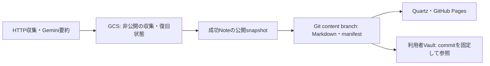

# kaname — 公開するLLM生成の技術Note

kanameは技術記事を収集し、Geminiで要約したNoteを独立した公開リソースとして提供します。
同じNote群を[公開Note一覧](https://github.com/Ningensei848/kaname/tree/content/notes)、
[GitHub Pages](https://ningensei848.github.io/kaname/)、利用者Vaultのgit submoduleで参照できます。
人力Vaultは利用者が別リポジトリで管理します。



生成NoteにはAI要約・重要ポイント・検索語・資料の位置づけ・出典・生成情報を含めます。
記事原文、raw HTML、認証情報、state/receipt/run reportは公開しません。
画像は選択した出典HTTPS URLから直接表示し、閲覧時に出典サイトへの外部通信が発生します。
公開Noteの元Markdown bytesとhashをGit/Webで保持します。

## 開始する

Python 3.12で、リポジトリrootから実行してください。パッケージ/CLI名は`techkb`です。

```bash
python3.12 -m venv .venv
source .venv/bin/activate
python -m pip install -r requirements.lock
python -m pip install --no-deps -e .
python -m techkb validate-config
python -m pytest -q
```

Windowsでは対応するvenvのPowerShell activateを使います。
ブラウザruntimeと日常の操作は[運用手順](docs/operations.md)、Node 24/npm 11によるWeb起動は[Web preview](docs/web-preview.md)を参照してください。

| 設定 | 役割 |
|---|---|
| `config/app.yaml` | モデル、呼出し/入力/出力上限、カテゴリ、保存・費用・通知 |
| `config/sources.yaml` | 情報源と取得方式。Google Research/GitHub Blog有効、AWS News無効 |
| `prompts/enrich.txt` | 本文を命令として扱わない要約・分類指示 |
| `GCS_BUCKET` | 非公開GCS保存先。ローカルADCまたはActions WIFで認証 |
| `GEMINI_API_KEY` | Gemini認証。環境変数またはGitHub Secretで渡す |

既定はstandard、30件/run、入力20,000文字、出力2,048 tokens、minimalです。
入力上限は記事Markdownの文字数で、打切りNoteにはその範囲を表示します。
予算設定は通知閾値です。既存Noteは設定変更で自動再要約しません。

```bash
python -m techkb run           # 有料生成・GCS更新を伴う通常収集
python -m techkb audit-state   # GCS読取りによる整合性検査
python -m techkb cost-report   # 保存済みusageからの費用推計
python -m techkb source-health # 収集元の状態をJSON表示
```

通常scheduleは毎日07:17 JST予定で、GitHub側の遅延があります。同じbucketのwriterは一つに限定します。
`dry-run`にも記事への通信があり、`run --max-calls 0`にも回収・保存があります。
操作ごとの副作用と復旧は[運用手順](docs/operations.md)で確認してください。

## 実装と次の作業

標準収集、公開export、Git配布、Pages、通常schedule、切戻し/復帰、旧R1〜R5は実装・受入済みです。
画像対応とSource Healthは実装済みです。現在の責務整理は[実装計画](docs/refactoring-plan.md)、
検証済み範囲と未完了の本番受入は[検証・受入](docs/verification.md)を参照してください。
画像入り実NoteとBatch成功保存、確定請求照合などの順序は[次の作業](docs/next-work.md)にまとめています。

## 資料

[文書の入口](docs/README.md)から、[仕様書](docs/specification.md)、[公開・配布契約](docs/publication.md)、
[運用手順](docs/operations.md)、[Git配布](docs/git-distribution.md)、[Pages](docs/pages.md)、
[Web preview](docs/web-preview.md)、[設計補足](docs/design-decisions.md)、[GCP設定](docs/gcp-setup.md)、
[source方針](docs/source-policy.md)、[バックログ](docs/roadmap.md)へ進めます。
採用した構成の背景は[ADR-0001](docs/adr/0001-generated-content-module-and-pages.md)、過去の作業証拠は[履歴](docs/archive/README.md)に保存します。
