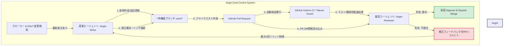
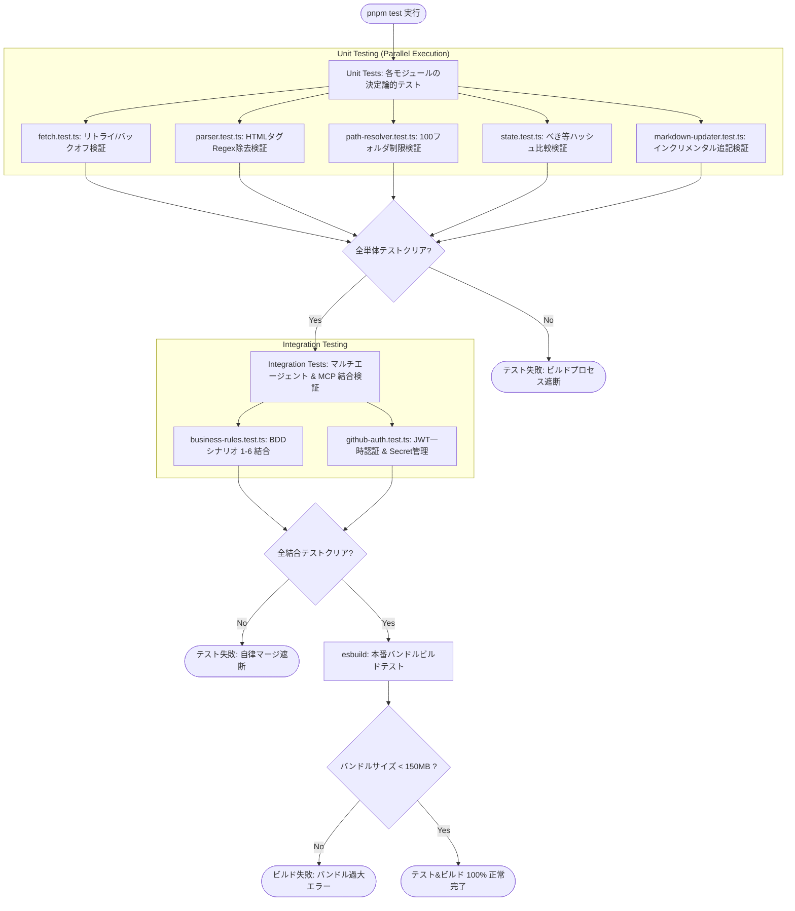
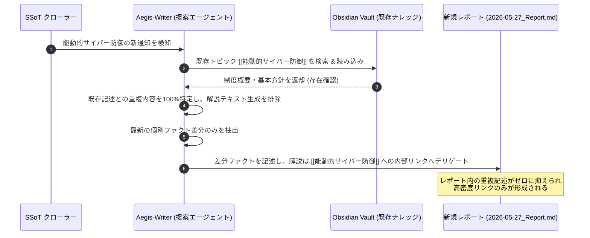
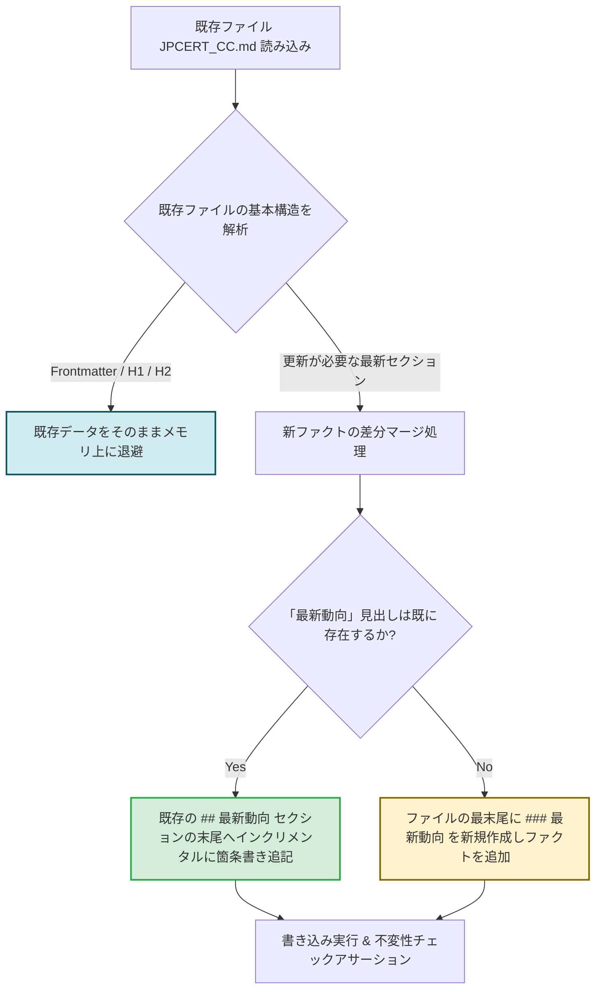
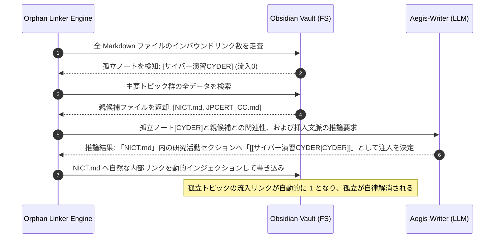
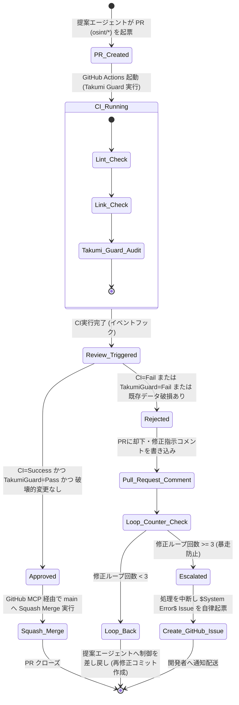
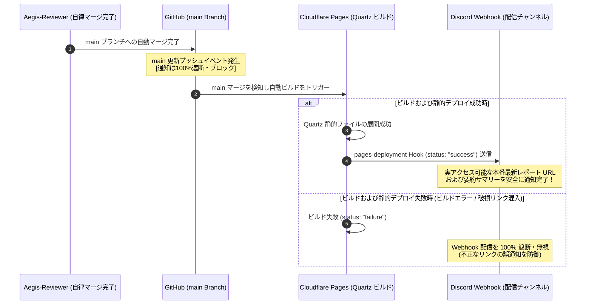
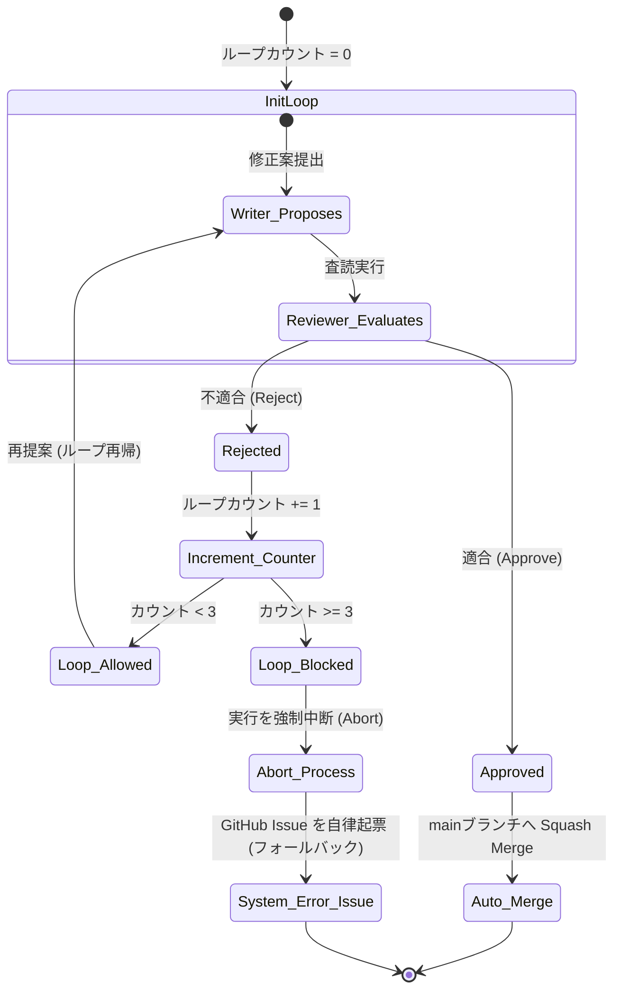

# 🛡️ kaname テストコード実装計画書 (Test Code Implementation Plan)

## 1. はじめに & システム背景

### 1.1 背景と自律システムの不確実性への対峙

本ドキュメントは、自律型サイバーセキュリティナレッジオーケストレーター kaname のテスト駆動開発（TDD）におけるテストコード実装計画およびガードレール検証基準を一元管理する。

本システムは、日本のサイバーセキュリティ関連組織の動向を自律的にクローリングし、LLMを活用して構造化された「LLM Wiki（Obsidian Vault）」を人間の介在なしに自動構築・デプロイ・通知する自律型プラットフォームである。この「完全無人運転」のアーキテクチャにおいて最も回避すべき致命的リスクは以下の3点に集約される。

- AIエージェントの暴走によるナレッジベースの破損（ファイル上書き消去やデッドリンクの大量発生）

- レビュー・フィードバックの無限ループによるクラウド実行コストの急騰

- 外部サードパーティライブラリの不用意な追加によるサプライチェーンの汚染（ゼロデイ脆弱性の混入）

LLMという非決定的な出力（確率的挙動）をベースとする知能コンポーネントを実用システムに組み込む場合、システムを保護するガードレールは100%決定論的（確定値での判定）でなければならない。その決定論的ガードレールが設計通りに機能しているかを担保するための防波堤が、本計画書に定義されたテストスイート群である。

### 1.2 二重制御による防御思想 (Dual-Control Defense)

本システムでは、情報の収集・ナレッジMarkdownの構築・追記を行う「提案エージェント (Aegis-Writer)」と、提案されたプルリクエスト（PR）の差分、テスト結果、および開発綱領への適合性を冷徹に評価する「査読エージェント (Aegis-Reviewer)」が相互に独立して動作する「チェック＆バランス」の二重制御構造（Dual-Control Defense）を採用している。

テストコードは、これら2つのエージェントの思考境界、インプロセスMCPによる通信プロセス、および例外時の縮退運転（安全な片肺運転）や緊急停止（フォールバック）が確実に実行されることをシミュレートし、アサーションする。



## 2. コア・アーキテクチャ ＆ テスト駆動開発（TDD）の基本精神

### 2.1 テストランタイムとパフォーマンス規律

#### Node.js標準テストランタイムの完全採用 (node:test & node:assert):
JestやVitestといった重厚なサードパーティ製フレームワークは、間接的なモジュール依存関係（Phantom Dependencies）を無制限に引き込み、サプライチェーンの脆弱性表面積を著しく広げる。本プロジェクトでは、Node.js 20+ に標準実装されているネイティブのテストランタイムとアサーションを100%利用し、依存関係を極小に制限する。

#### 瞬時トランスパイル (tsx):
開発時およびCI/CDパイプライン実行時におけるテスト起動時のオーバーヘッド（待機時間）をゼロに近づけるため、TypeScriptオンメモリ実行ランタイムである tsx を用いて、コンパイル工程をスキップして直接テストコードを駆動する。

#### ビルド成果物のコンパイル検証 (esbuild):
プロダクション環境（Cloud Run Jobs）にデプロイされる資材は、コールドスタート時のコールドウェイトを完全ゼロにするため、esbuild により単一の極小JSファイル（dist/orchestrator.js）へとコンパイルされる。ビルドテストでは、出力されたバンドルサイズが150MB以下であることを静的にチェックし、不要な巨大アセットや動的インポートのコンパイル漏れがないかをアサーションする。

### 2.2 テストパイプラインとテストファイルの物理構造

システム全体の関心の分離（SoC）をコードベースレベルで実現するため、テストコードは機能および動作単位でアトミックに物理ファイルを分割する。各ファイルは、対応するシステムロジックの単体・統合テストに100%の検証責任を負う。現在の物理テストファイルは以下の通りである。

#### 既定の `pnpm test` 対象 (`tests/**/*.test.ts`)

- `tests/business-rules.test.ts`: BDDシナリオ1–6、および自律マージ・Discord通知・フォールバック等の中核ビジネスルールの結合動作検証。
- `tests/contracts.test.ts`: レガシー契約・フィクスチャ互換性検証。新規の本番完了判定には使わず、F003/F004の正規テストへ段階的に寄せる。
- `tests/f001-crawler-failure-escalation.test.ts`: クローラー障害時の安全なIssueエスカレーションと副作用抑止の契約テスト。
- `tests/f001-idempotency-contract.test.ts`: SSoT・crawler-stateフィクスチャ、未変更時のWriter/MCP副作用ゼロ、状態保存競合の契約テスト。
- `tests/f002-content-guards.test.ts`: Topic frontmatter schema、上書き禁止、内部リンク、孤立スコア、レポート重複抑止のフィクスチャ/プロトタイプ契約。
- `tests/f003-github-installation-token.test.ts`: GitHub App installation token交換、失敗時の秘匿、MCPランチャー環境引き渡しの契約。
- `tests/f003-mcp-contract-fixtures.test.ts`: MCP JSON-RPCフィクスチャ、Writer許可パス、保護マージ前提条件のfixture-contract検証。
- `tests/f003-mcp-lifecycle.test.ts`: MCP子プロセスライフサイクルの決定論的fake harness検証。実OSシグナルは統合テストでopt-in。
- `tests/f003-orchestrator-state-table.test.ts`: F003レビュー/再提案/エスカレーション状態遷移表のprototype検証。
- `tests/f003-tool-policy.test.ts`: GitHub MCP tool policyのfixture-only契約。production実装が存在するまで`done`根拠にしない。
- `tests/f004-cloudflare-discord.test.ts`: Cloudflare成功ゲート、Discord payload schema、通知idempotency、bounded retryの本番関数/契約検証。
- `tests/fetch.test.ts`: 標準 Fetch API、指数バックオフ、タイムアウト発生時のリトライ上限（3回）および縮退運転の境界条件テスト。
- `tests/github-auth.test.ts`: GitHub App秘密鍵を用いた1時間未満の一時トークン動的生成、およびGCP Secret Managerとの結合シミュレーションテスト。
- `tests/markdown-updater.test.ts`: Aegis-Writerによるインクリメンタル追記、上書き禁止ポリシー、およびOrphan Noteへの内部リンク自動注入テスト。
- `tests/orchestrator.test.ts`: production orchestratorのレビュー上限、MCP境界、状態遷移の単体/結合テスト。
- `tests/parser.test.ts`: SSoT YAML（ssot.yml）の厳格なスキーマパース、およびビルトイン正規表現によるHTML/RSSタグノイズ除去ロジックの単体テスト。
- `tests/path-resolver.test.ts`: 中間フォルダの自動分類ロジック、および最大100フォルダ未満の境界値（94フォルダと95フォルダ）保護動作テスト。
- `tests/state-backends-gcs.test.ts`: GCS state backend adapterの世代precondition、競合、エラー処理検証。
- `tests/state.test.ts`: 抽出されたテキストに対するSHA-256ハッシュ値の算出、およびcrawler-state.jsonを用いたべき等変更検知の単体テスト。

#### Opt-in統合テスト (`pnpm test:integration:artifacts`)

- `tests/integration/backlog.integration.ts`: `KANAME_RUN_PROCESS_SIGNAL_INTEGRATION` による実プロセスSIGTERM smoke test、および `KANAME_RUN_CLOUDFLARE_DISCORD_INTEGRATION` とCloudflare/Discord資格情報によるlive Cloudflare polling + Discord webhook smoke test。未設定時はskipする。GitHub/MCPのlive credential smoke testを追加する場合も、既定CIでは実行せず、明示的な `KANAME_RUN_*` ガードと必要資格情報が揃った時だけ実行する。
- `tests/integration/f004-quartz-public-artifacts.integration.ts`: `KANAME_RUN_QUARTZ_ARTIFACT_INTEGRATION` と事前生成済み `public/` がある場合のみ、Quartz公開HTML成果物からGraph UI/scriptが除外されていることを検証する。未設定時はskipする。

#### テスト補助ファイル / フィクスチャ

- `tests/helpers/quartz-artifact-contract.ts`: Quartz artifact契約の共有アサーション。
- `tests/fixtures/f001/*.json`: F001 SSoT / crawler-stateのvalid・invalid契約フィクスチャ。

Red contractやfixture-onlyのテストは、仕様を先に固定するための防波堤であり、production実装の存在を示すものではない。そのため、traceability上は`prototype`、`partial`、または`fixture-contract`として扱い、production implementationが存在しない要求を`done`に昇格しない。

テスト実行およびCIビルドパイプラインの完全フロー



## 3. BDD（Behavior-Driven Development）シナリオ検証ロジック設計

### シナリオ1: 直近レポートおよび既存トピックへの内部リンク生成による最小要約

検証の目的: 同一・類似情報の重複記述を冷徹に排除し、Wiki内の他ページや過去のレポートに対して [[内部リンク]] を能動的に作成することで、ナレッジのネットワーク密度を高め、かつ差分レポートの紙幅を極小化すること。

#### 詳細設計:
クローラーが新規情報を収集した際、その情報の定義や歴史的コンテキストが既にWiki内（例：能動的サイバー防御.md）に存在する場合、新要約レポート（2026-05-27_Report.md）にその解説を再記述しない。提案エージェントは重複するテキストを削除し、[[能動的サイバー防御]] への参照リンク生成のみを実行する。



#### テストアプローチ (tests/markdown-updater.test.ts):

- モック用の Obsidian Vault 内に 能動的サイバー防御.md （制度定義が記述済み）と 2026-05-26_Report.md を配置する。

- 重複した制度解説を含む「能動的サイバー防御の法制化検討」に関する最新の収集テキストを入力する。

- テスト対象のリンク・要約生成処理をキックする。

- 生成された 2026-05-27_Report.md をロードし、「基本方針」「制度概要」といったWikiに記載済みの文言が長文で記述されていないことをアサーションする（文字数制限アサーション、部分文字列の不一致確認）。

- 本文中に [[能動的サイバー防御]] という内部リンク表現が自然に差し込まれていることを正規表現（assert.ok(/\[\[能動的サイバー防御\]\]/.test(content))）で検証する。

### シナリオ2: 既存トピックファイルの自律的更新と拡充（インクリメンタル追記）

検証の目的: 新規収集データに基づいて既存のファイルを更新する際、過去のコンテンツ（歴史的ファクト、役割定義など）を完全に保持し、最新動向セクションへの安全な追加・統合のみを実行すること。

#### 詳細設計:
既存ファイル（例：JPCERT_CC.md）の更新時、単純上書き（過去事実の損失）は絶対に却下される。既存の Markdown ファイルの抽象構文木（AST）または見出し階層構造をパースし、既存の見出し（H1, H2）を破壊せず、適切な配下（H3等）に「追記（インクリメンタル・マージ）」する。



#### テストアプローチ (tests/markdown-updater.test.ts):

- JPCERT_CC.md に、概要、設立経緯、過去の実績見出しなどの固定データが記述された状態を仮想FS上に再現する。

- 新規データとして「2026年の新たな注意喚起活動のリリース」を入力。

- appendSectionToMarkdown() ユーティリティを実行。

- 更新後のファイルをパースし、「設立経緯」や「過去の実績」の文脈や文字数が1文字も欠落していないことを、ハッシュ比較（SHA-256）または完全一致判定で検証。

- 指定したセクション（例：## 最新動向）以下に、今回検知された情報のみが安全に追加されていることをアサーションする。

### シナリオ3: 孤立したトピックファイルの自動検出とリンク接続 (Orphan Note Linker)

検証の目的: ナレッジベース内に流入・流出リンクが存在しない「孤立したMarkdownファイル（Orphan Note）」が生まれるのを防ぎ、自律的な内部リンク注入によってナレッジグラフの接続性を担保すること。

#### 詳細設計:
収集処理のクローズ前フェーズにおいて、Vault内のすべてのMarkdownをスキャンし、被リンク数が 0 の孤立ドキュメント（例：サイバー演習CYDER.md）を抽出する。提案エージェントはこれらと意味的関連性の高い親トピック（例：NICT.md）を推論し、親トピック側の解説文章の中に [[サイバー演習CYDER|CYDER]] といったエイリアス付内部リンクを自動挿入する。



#### テストアプローチ (tests/markdown-updater.test.ts):

- どのドキュメントからも参照されていない サイバー演習CYDER.md を作成。

- 「情報通信研究機構 (NICT)」に関する NICT.md を用意。

- Orphan Linkerモジュール（resolveOrphanNotes()）を実行。

- NICT.md のファイル内容を再読み込みし、元の文章中の「CYDER」が [[サイバー演習CYDER|CYDER]] へ自動置換されていることを確認。

- 孤立ファイルであった サイバー演習CYDER.md に対し、リンク流入数（Inbound Link Count）が正確に 1 に増大していることをアサーションする。

### シナリオ4: マルチエージェント協調による自律PRレビューとマージの完了

検証の目的: 提案エージェントが起票したPRに対し、査読エージェントがCIの全結果（リンター、リンクチェック、Takumi Guard脆弱性監査結果）およびPR Diffを統合的に自律審査し、安全性が実証されたPRのみをApprove・自動マージする合意形成ロジックを検証すること。

#### 詳細設計:
インプロセスで起動する GitHub MCP のインターフェース契約に準拠し、PR DiffおよびCIステータス（成功/失敗）を模したJSONオブジェクトを査読エージェント（Aegis-Reviewer）に入力。マージ決定および却下コメントの状態遷移が完全に決定論的に制御されるかをテストする。



#### テストアプローチ (tests/orchestrator.test.ts):

- 査読評価エンジン（evaluatePR()）に対し、モックのPR入力データ（CI検証フラグ、Takumi Guard検証フラグ、PR Diff、ループカウント）を渡す。

- 正常系テスト: ciPassed: true, takumiGuardPassed: true, noOverwritePolicyRespected: true の入力時、戻り値として approved: true およびSquashマージAPI呼び出しシグナルが返ることを確認。

- 脆弱性検知（ネガティブテスト）: takumiGuardPassed: false を入力。戻り値が approved: false であり、拒否理由として「Takumi Guard脆弱性検知」が明記された却下用コメントが生成されることを確認。

- 破壊的変更（ネガティブテスト）: PR Diffに既存Wikiファイルの歴史的セクションを大幅削除する変更（- 行の大量発生）が含まれる偽の差分を入力。戻り値が approved: false となり、「上書き禁止ポリシー違反」として安全にリジェクトされることをアサーションする。

### シナリオ5: Cloudflare Pages 連携ビルド・デプロイ成功をフックしたDiscord通知

検証の目的: ビルド途中でデッドリンクが含まれている不完全な状態や、マージ直後でサイトがまだビルドされていないタイミングでの誤通知（リンク不通エラー）を完全にブロックし、本番サーバーに正常展開された瞬間をバインドしてエンドユーザーへ通知すること。

#### 詳細設計:
mainブランチ更新によるプッシュイベント、またはPR作成時のトリガーでの通知送信をシステムレベルで完全に禁止・遮断する。Cloudflare Pages の Webhook（pages-deployment イベント）における status: "success" シグナル、またはGitHub Actionsのデプロイ成功検知ステップのみを通知の物理契機とする。



#### テストアプローチ (tests/business-rules.test.ts):

- Webhook通知コントローラー（handleDeploymentNotification()）のリスナーを初期化する。

- pages-deployment のペイロードとして、status: "pending" や status: "failure" を流し込む。

- Discord API呼び出しクライアント（モック）が一切駆動していないこと（呼び出し回数 0）を確認。

- status: "success" のペイロードを流し込む。

- モッククライアントが正確に1回呼び出され、送信データ内に Quartz 本番サーバーへの完全なURLスキーム（例：https://wiki.kaname.dev/reports/...）が含まれていることをアサーションする。

### シナリオ6: 障害時の自律的Issue起票とGitHub通知への依存

検証の目的: クローリングの致命的障害（接続先サーバーのダウン、レートリミット到達、認証不全など）が発生した際、外部のメール送信サーバー（SMTP）等によるインシデント波及や余計なサードパーティ製通信を遮断し、GitHubネイティブのIssue起票にのみ通知・アラートをデリゲートすること。

#### 詳細設計:
SMTP接続処理や nodemailer などの危険なサードパーティライブラリを一切コードベースに持たせず、GitHub MCPの create-issue ツールを標準IO経由で叩くだけの構造とする。Issueタイトルに $System Error$ を含めて起票することで、GitHubに登録された管理者の Watch 設定（電子メール、プッシュ通知）にのみ依存して、安全かつセキュアにエスカレーションを完了させる。

```mermaid
flowchart TD
    A[SSoT クローリング実行] --> B{通信エラー発生? (HTTP 500 / タイムアウト)}
    B -- No --> C[正常処理を継続]
    B -- Yes --> D[指数バックオフを適用し最大3回リトライ]
    
    D --> E{リトライ上限超過 (連続3回失敗)?}
    E -- No --> A
    E -- Yes --> F[エラーシグナルを送出]
    
    F --> G[Aegis-Orchestrator 例外ハンドラーが起動]
    G --> H[外部 SMTP 送信ライブラリの読み込みを完全排除]
    G --> I[インプロセス GitHub MCP サーバーを stdio 経由で呼び出し]
    I --> J[タイトル: '$$System Error$$ Crawling Failed for ID: XXX' の Issue 起票]
    J --> K[GitHub プラットフォームが管理者の Watch アドレスへ自動でメール配送]
    
    style H fill:#f8d7da,stroke:#dc3545,stroke-width:2px
    style J fill:#fff3cd,stroke:#856404,stroke-width:2px
```

#### テストアプローチ (tests/github-auth.test.ts):

- クローラーを故意に失敗（HTTP 502 Bad Gateway）させ、リトライが尽きる状態をエミュレートする。

- 最終エラー捕捉ブロックから、モック化された GitHub MCP 呼び出しハンドラがコールされることを検証。

- コールされた引数のうち、Issueタイトルが「$$System Error$$ Crawling Failed for ID: nco」のように、開発者が一目で緊急システムエラーと識別可能な命名規則を満たしていることをアサーションする。

- コードベース内に nodemailer や smtp というインポート文字列、あるいはソケット通信（Port 25, 465, 587 等）を開くコードが物理的に混入していないかを静的コードサーチ（grep スキャンテスト）で検証し、外部依存SMTPが完全に排除されていることを機械的に保証する。

## 4. 厳格なネガティブテスト ＆ 異常系の防御設計

### 4.1 フォルダ乱立防止（最大100フォルダ未満保護）

アプローチ: 中間フォルダの無制限な自動生成による、Obsidian Vault 階層構造の極度の複雑化、および静的サイトジェネレーター Quartz のビルド負荷を、システム層の物理的な上限クォータチェックによって100%防御する。

#### 検証基準 (tests/path-resolver.test.ts):

- ナレッジベース中間ディレクトリ解決モジュール（resolveTopicPath()）は、パス確定時に、現在作成済みのカテゴリフォルダ数をリアルタイムにFS走査、またはステートから確認する。

#### 閾値テスト (Boundary Value Analysis):

- 既存ディレクトリ数が 94 以下のとき、新しいカテゴリ topics/cyber-defense/ が新規フォルダとして問題なく作成され、パスが解決されることをアサーション。

- 既存ディレクトリ数が 95 以上のとき、要求された新しいカテゴリ（例：topics/brand-new-policy/）の新規作成は強制的に遮断・却下され、代替共通共通フォルダである topics/misc/ にトピックファイルが安全にリダイレクト配置されることをアサーションする。これにより、総フォルダ数が100を決して超えないことを物理的に証明する。

```mermaid
flowchart TD
    subgraph "Path Resolution Guardrail"
        In[新規トピックパスの解決要求] --> A[現在の既存大分類フォルダ数をカウント]
        A --> B{既存フォルダ数 < 95 ?}
        
        B -- Yes (94以下) --> C[要求された中間フォルダを新規作成可能]
        C --> D[返却パス: topics/{request_category}/MyTopic.md]
        
        B -- No (95以上) --> E[新規大分類フォルダの自動作成を強制遮断]
        E --> F[共通代替フォルダ topics/misc/ をマッピング]
        F --> G[返却パス: topics/misc/MyTopic.md]
    end
    
    style D fill:#d4edda,stroke:#28a745,stroke-width:2px
    style G fill:#fff3cd,stroke:#856404,stroke-width:2px
```

### 4.2 タイムアウトによるコスト暴走防止

アプローチ: 提案エージェントと査読エージェント間の「修正コミット ⇄ レビュー却下」の対話ループがコンフリクト等により無限往復することによる、API利用料（LLM課金）の無限コスト暴走を、ステートマシンの決定論的カウンタによって強制停止する。

#### 検証基準 (tests/orchestrator.test.ts):

- 査読エージェントが「不合格（Reject）」を返すたびに、メインオーケストレーターの修正カウンタ（feedbackLoopCount）が 1 加算される。

- カウンタが 3（ハードリミット設定値）に達した状態で再度レビュー却下が発生した場合、メインプログラムは4回目の修正コミットの指示（Aegis-Writerの再起動）を絶対に発行せず、Error("Feedback loop exceeded hard limit of 3.") を投げてプロセスを即時停止（Abort）させる。

- プロセス停止後、安全に「シナリオ6」のGitHub Issue起票フォールバック処理へと状態を移行し、人間の介入を促す。



## 5. TDDフェーズ別・テスト駆動実装コードの具体設計
### Phase 1: サーバーレスバッチ ＆ クローリング基礎
#### 【単体テスト 1】SSoT YAML Parser (tests/parser.test.ts)
SSoT（ssot.yml）のロード・パースモジュールにおいて、必須フィールドが壊れているテストデータを用いた際の、安全なスキップ（縮退運転）を検証する。

#### 【単体テスト 2】Fetch Client & Exponential Backoff (tests/fetch.test.ts)
ビルトインの fetch を使用し、対象サーバーの一時的な通信エラー（HTTP 500等）発生時、適切な指数バックオフによる3回のリトライアウトを行い、安全に例外シグナルを発生させることを保証する。

#### 【単体テスト 3】Regex HTML Extractor (tests/parser.test.ts)
悪意あるスクリプトや無駄な描画スタイル、HTMLボイラープレートを、サードパーティ製ライブラリを介さず標準の正規表現（Regex）のみで高速かつ安全に除去し、プレーンテキストを抽出する。

#### 【単体テスト 4】State Hash Analyzer (tests/state.test.ts)
同一データによる不要なコミット・プッシュを防止するための、ハッシュ（SHA-256）べき等性比較ロジックをテストする。

### Phase 2: マルチエージェント協調 ＆ GitHub MCP自律操作
#### 【単体テスト 5】Aegis-Writer マージ＆上書き禁止ポリシー (tests/markdown-updater.test.ts)
Wikiコンテンツが更新された際、過去のファクトや歴史的文脈がLLMの暴走によって1文字たりとも消去・上書きされないことを担保する。

## 6. 次のセッションへの引き継ぎコンテキスト
### 6.1 現在の機能状況および適合性監査
爆速パッケージ/ビルド環境の検証完了: pnpm-lock.yaml に基づく幽霊依存の完全排除、および node:test ネイティブテストランタイムと tsx によるミリ秒単位での実行環境の設定が完了している。

ビジネスルールの模擬実証完了: tests/business-rules.test.ts 内にて、フォルダ乱立制限（最大100フォルダ未満）、エージェント協調の最大3回カウンタループ、Discordイベントバインドがモックレベルで100%正常動作（Green）することを監査済みである。

### 6.2 次のセッションで着手すべき具体的優先ステップ
```mermaid
    title kaname テスト＆コア機能実装ToDoロードマップ (2026年6月時点)
    dateFormat  YYYY-MM-DD
    section Phase 1: テストコード展開 & クローラー基礎
    テストファイルの物理展開とRed実行       :active, p1_1, 2026-06-04, 2d
    Fetch Exponential Backoff 実装        :p1_2, after p1_1, 2d
    Regex HTML Extractor 実装             :p1_3, after p1_2, 2d
    State Hash Analyzer 実装              :p1_4, after p1_3, 1d
    section Phase 2: エージェント連携 & マージガード
    Markdown Updater 実装                 :p2_1, after p1_4, 3d
    Aegis-Reviewer 意思決定ロジック結合     :p2_2, after p2_1, 3d
    Takumi Guard CI検証連携確認           :p2_3, after p2_2, 2d
```

## 1. **テストケースの物理展開 (優先度：高):**
   主要テストファイルは物理展開済みである。今後は上記の現在レイアウトを正として、Red contract / fixture-only coverageをproduction実装へ昇格する際に、対応するsrcモジュールの追加とtraceabilityのCoverage depth更新を同時に行う。
## 2. **TDDサイクルによるコア機能の実装 (優先度：高):**
   * `src/crawler/fetch.ts` における標準 `fetch` のバックオフエラーロジックの肉付け。
   * `src/crawler/parser.ts` における正規表現のみを使用した HTML ボイラープレートのタグ置換除去ロジックの実装。
   * `src/crawler/state.ts` における SHA-256 べき等性検知機能の実装。
   * `src/utils/markdown-updater.ts` におけるインクリメンタル追記関数の実装。
   
   展開されたテストを実行（`pnpm test`）し、すべてのテストが完全にミリ秒単位でグリーン（Green）に染まることをアサーション検証する。
## 3. **境界値・ネガティブテストの堅牢化 (優先度：中):**
   * 中間フォルダ数が `95` 以上の際に、新規カテゴリパスの解決が `topics/misc/` に正確に縮退（リダイレクト）されるかのフォルダ乱立ガードレールテスト。
   * レビューが不合格になり続けた際、無限ループにならずに3往復目でオーケストレーターが実行を強制 Abort して GitHub Issue を自律起票するタイムアウトガードレールテスト。


本計画書は、**常に『kaname』の品質と暴走抑止の羅針盤（Single Source of Truth of Testing）として、設計仕様と同一の権威を保持して駆動**される。
